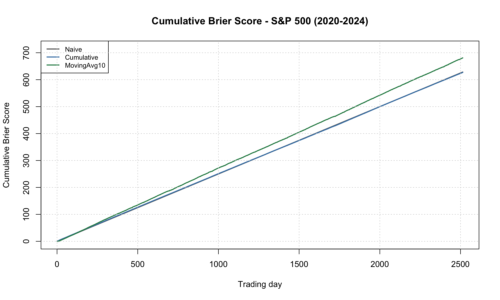
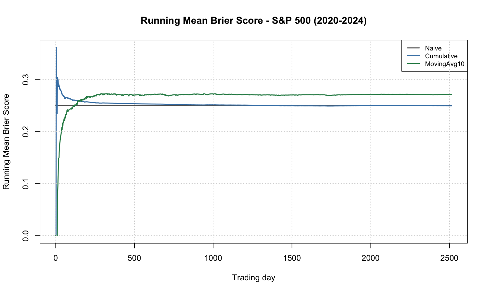
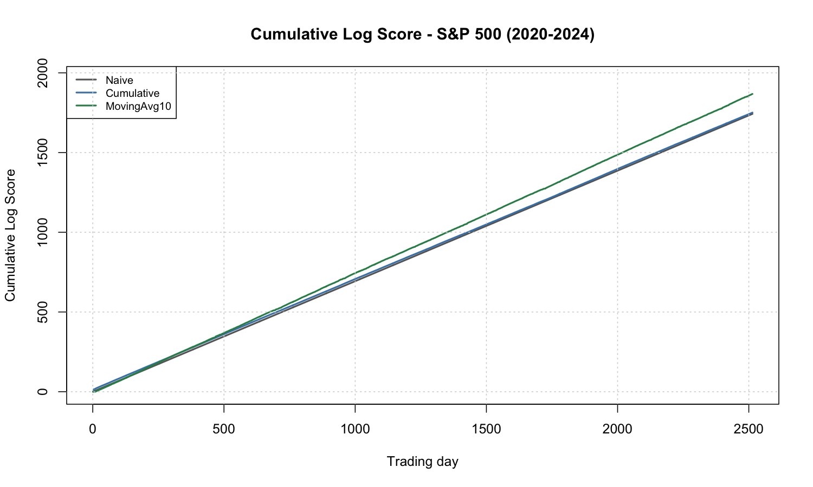
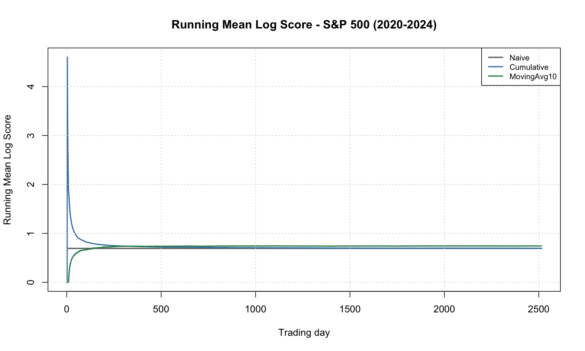

# Proper Scoring Rules - Previsioni direzionali su S&P 500

## Come eseguire

Dalla directory del progetto:

```bash
Rscript src/main.R
```

---

## Introduzione

Prima di introdurre la definizione di **scoring rule**, rispolveriamo quella di **spazio di probabilità**:

> [!IMPORTANT]
> Uno Spazio di probabilità è una terna $(\Omega, \mathcal{F}, \mathcal{P})$ che costituisce il modello di un esperimento aleatorio.
> In particolare:
>
> - $\Omega$ è lo spazio campionario, l'insieme dei casi elementari.
> - $\mathcal{F}$ Insieme di eventi, costituente una $\sigma$-algebra rispetto a $\Omega$.
> - $P$ è una funzione di probabilità che assegna ad ogni evento $E \in \mathcal{F}$ una probabilità $p \in [0,1]$.

## Definizione di Scoring rule

Ora, ipotizziamo di non avere un'unica funzione di probabilità $P$, bensì un insieme $\mathcal{P}$ di funzioni di probabilità definite su $(\Omega, \mathcal{F})$. A questo punto, possiamo definire una generica **scoring rule** $s$ come:

$$s: \mathcal{P}\times\Omega \rightarrow \mathbb{R}$$

$s$ è quindi una funzione che assegna una penalizzazione a una previsione probabilistica, determinata da una funzione di probabilità $P \in \mathcal{P}$, sulla base dell'esito effettivamente osservato.

### Properness

Una scoring rule si dice **appropriata** se il punteggio atteso è **minimizzato** quando la distribuzione di probabilità valutata dal previsore corrisponde a quella che decide di annunciare.

In altre parole, il previsore è incoraggiato a riportare il suo effettivo **grado di fiducia** al fine di minimizzare la penalizzazione.

> [!WARNING]
> Ricorda che le scoring rule sono funzioni di penalizzazione aventi orientamento negativo, pertanto, minore è il punteggio atteso $\mathbb{E}[s(P, \omega)]$, meglio è.

Formalmente, siano $P$ la distribuzione che il previsore valuta ($P$ è sincera), e $Q$ una qualsiasi distribuzione alternativa che il previsore annuncia. La scoring rule $s$ è **appropriata** se:

$$
\mathbb{E}_{P}[s(P, \omega)] \leq \mathbb{E}_{P}[s(Q, \omega)] \quad \text{per ogni } P, Q \in \mathcal{P}
$$

Ovvero se la penalizzazione media della distribuzione vera $P$, è **al più** uguale a quella della distribuzione $Q$.

#### Strict Properness

Se l'uguaglianza:

$$\mathbb{E}_{P}[s(P, \omega)] = \mathbb{E}_{P}[s(Q, \omega)]$$

Vale solo per $P=Q$, allora la scoring rule è **strettamente appropriata**.

---

## Scoring rules utilizzate

### Brier Score

#### Caso generico

Supponiamo che un evento possa ricadere in $R$ classi incompatibili. Indichiamo con $p_i$ la probabilità prevista per la classe $i$, e con $o_i$ l'esito osservato, dove $o_i = 1$ se si è verificata la classe $i$, $0$ altrimenti. Il Brier score per una singola osservazione è definito come:

$$
\text{BS} =\sum_{i=1}^{R}(p_i - o_i)^2
$$

#### Caso binario

Nel caso binario ($R = 2$), le classi sono due: l'evento, che definiamo con $E$, si verifica ($i = 1$), oppure no ($i = 2$). Pertanto, possiamo definire una formulazione semplificata utilizzando l'indicatore $|E|$:

$$
\text{BS} = (p - |E|)^2
$$

> [!TIP]
> Supponiamo di voler prevedere l'evento R="Domani pioverà", assegnandogli una probabilità $p$:
>
> - $p = 1 \text{ e piove} \Rightarrow \text{BS} = (1-1)^2 = 0$. Il miglior punteggio possibile.
> - $p = 1 \text{ e non piove} \Rightarrow \text{BS} = (0-1)^2 = 1$. Il peggior punteggio possibile.
> - $p = 0.5 \text{ e (piove o non piove)} \Rightarrow \text{BS} = (1 - 0.5)^2=(0-0.5)^2=0.25$. In questo caso il punteggio è uguale a $0.25$ a prescindere dall'esito osservato.

> [!IMPORTANT]
> Applicando la formula generica al caso binario, il risultato sarà uguale al **doppio** di quello ottenuto tramite formulazione semplificata.

Notiamo che il Brier score, nel migliore dei casi, ovvero quello con probabilità prevista **coincidente** all'esito osservato, sarà uguale a $0$. Tenerlo a mente ci tornerà utile nella definizione di **scoring rule appropriata**.

### Logarithmic Score

#### Caso generico

Supponiamo, come per il Brier score, che un evento possa ricadere in $R$ classi incompatibili, con $p_i$ probabilità prevista e $o_i$ esito osservato per la classe $i$. Il Logarithmic score per una singola osservazione è definito come:

$$
\text{LS} = -\sum_{i=1}^{R} o_i\log(p_i)
$$

#### Caso binario

Nel caso binario ($R = 2$), la formula si riduce a:

$$
\text{LS} = -\left[|E| \cdot\log(p) + (1 - |E|)\cdot\log(1 - p)\right]
$$

> [!TIP]
> Riprendiamo l'evento R="Domani pioverà", con probabilità prevista $p$:
>
> - $p = 1 \text{ e piove} \Rightarrow \text{LS} = -\left[1 \cdot \log(1) + 0  \cdot \log(0) \right]=-\log(1) = 0$. Il miglior punteggio possibile.
> - $p = 0.5 \text{ e piove} \Rightarrow \text{LS} = -\log(0.5) \approx 0.693$.
> - $p = 0.01 \text{ e piove} \Rightarrow \text{LS} = -\log(0.01) \approx 4.605$. Penalizzazione molto alta.

> [!IMPORTANT]
> A differenza del Brier score, il Logarithmic score **non è limitato superiormente**: una previsione $p \to 0$ per un evento che poi si verifica produce $\text{LS} \to +\infty$. Questo rende il log score particolarmente severo nei confronti di previsioni "bugiarde".

---

## Setup sperimentale

### Dati

I dati, OHLC di aggregazione giornaliera, dell'indice S&P 500 sono contenuti nel file [`sp500_ohlc.csv`](sp500_ohlc.csv), scaricato da Yahoo Finance. Il file copre il periodo 2015-2024.

Dai prezzi di chiusura si calcolano i rendimenti aritmetici giornalieri:

$$r_t = \frac{P_t - P_{t-1}}{P_{t-1}}$$

La valutazione delle strategie avviene sull'intera serie storica: ogni previsione $p_t$ viene formulata utilizzando esclusivamente informazioni disponibili fino al giorno $t-1$, evitando così il *look-ahead bias*.

### Evento binario

$$Y_t = \begin{cases} 1 & \text{se il rendimento del giorno } t \text{ è positivo} \\ 0 & \text{altrimenti} \end{cases}$$

### Strategie di previsione

Ogni strategia produce una probabilità $p_t \in (0, 1)$ di rialzo per il giorno $t$:

1. **Naive**: $p_t = 0.5$ costante, funge da benchmark.

2. **Cumulative** (frequenza cumulata): media cumulata degli esiti passati.
3. **MovingAvg10** (media mobile): frequenza di rialzi nella finestra degli ultimi $10$ giorni.

---

## Output e risultati

Il codice produce una tabella riassuntiva a terminale e quattro grafici PNG nella cartella [`results/`](results/).

### Tabella riassuntiva

| Strategia   | Mean Brier | Mean Log |
| ----------- | ---------- | -------- |
| Naive       | 0.25000    | 0.69315  |
| Cumulative  | 0.24951    | 0.69676  |
| MovingAvg10 | 0.27196    | 0.74583  |

### Brier Score cumulato



### Brier Score medio cumulato



### Log Score cumulato



### Log Score medio cumulato



## Conclusioni

Dal momento che la frequenza cumulata di rialzi $p_t^{\text{Cum}}$ si stabilizza molto vicino a $0.5$, la strategia **Cumulative** e la **Naive** ottengono score pressoché equivalenti, con una lieve penalizzazione della Cumulative sul log score dovuta alla maggiore variabilità nelle prime osservazioni.

La **MovingAvg10**, nonostante sia più reattiva, paga il rumore della finestra corta: produce stime più lontane da $0.5$ e viene punita dalle scoring rules.
